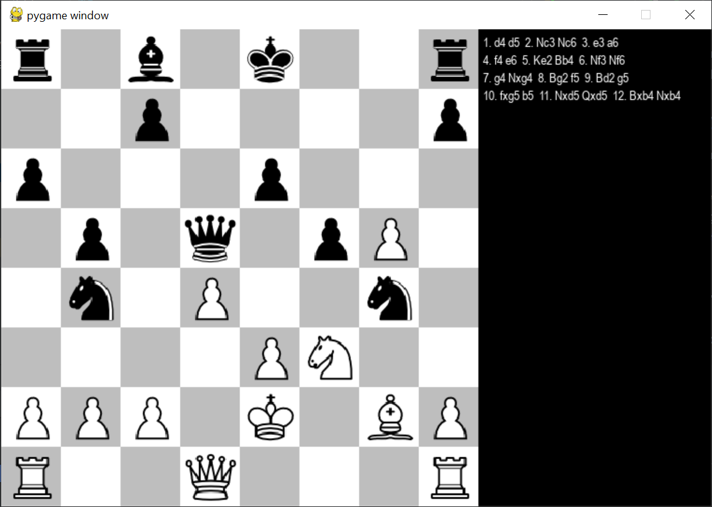
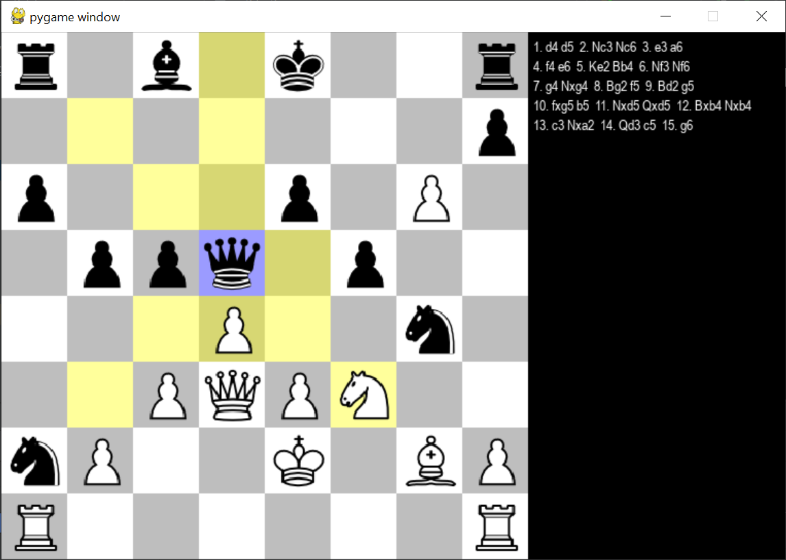

# PyChess: A Chess Engine in Python with Pygame

PyChess is a Python-based chess engine developed using Pygame. It offers an interactive chess-playing experience with features like player vs player, player vs AI, animations, and move highlighting.

Recommended use Pycharm
or VScode after creating a virtual environment

## Features

To change the modes, you can change the variables `PlayerOne` and `PlayerTwo` to TRUE inside the ChessMain.py inside 
Main method.

### 1. Player vs Player (PvP)
   - Engage in classic chess matches with another human player.
   - Play on a user-friendly Pygame interface.
   - `PlayerOne` = True
   - `PlayerTwo` = True

### 2. Player vs AI
   - Challenge the AI opponent with different difficulty levels.
   - SmartMoveFinder.py employs algorithms to provide challenging moves.
   - `PlayerOne` = True
   - `PlayerTwo` = False

### 3. AI vs AI (If you don't know how to play) 
   - If you're new to chess and want to learn more about it 
   - `PlayerOne` = False
   - `PlayerTwo` = False
### 3. Animations
   - Enjoy smooth piece movements and captures with animated transitions.
   - Enhances the overall gaming experience.

### 4. Move Highlighting
   - Visually track available moves and potential captures during gameplay.
   - Provides clarity on legal moves for both players.

## Getting Started

### Prerequisites

Before running PyChess, ensure you have Python and Pygame installed.

```bash
pip install pygame
```

### Installation
Clone the repository:
```
 git clone https://github.com/zeeshanibrarali/Chess-Engine-in-python-using-pyGame
 cd chess
```
### Run the game:
python ChessMain.py
## Usage
### Player vs Player
 - Select the piece you want to move by clicking on it.
 - Click on the destination square to make your move.
 - Continue until the game concludes.

### Player vs AI
 - Choose the difficulty level (Easy, Medium, Hard) when prompted.
 - Make your moves following the Player vs Player instructions.
 - Challenge yourself against the AI opponent.

### Controls
 - Select Piece: Click on the piece you want to move.
 - Make Move: Click on the destination square.
 - Undo Move: Press 'Z'.
 - Reset Board: Press 'R'.

## Contributing
Contributions are welcome! If you have ideas, bug fixes, or feature enhancements, please follow these guidelines:

### Fork the repository.
 - Create a new branch: git checkout -b feature/your-feature.
 - Commit your changes: git commit -m 'Add some feature'.
 - Push to the branch: git push origin feature/your-feature.
 - Submit a pull request.

## Acknowledgments
Thanks to the Pygame community for the graphics library.

## Screenshots





